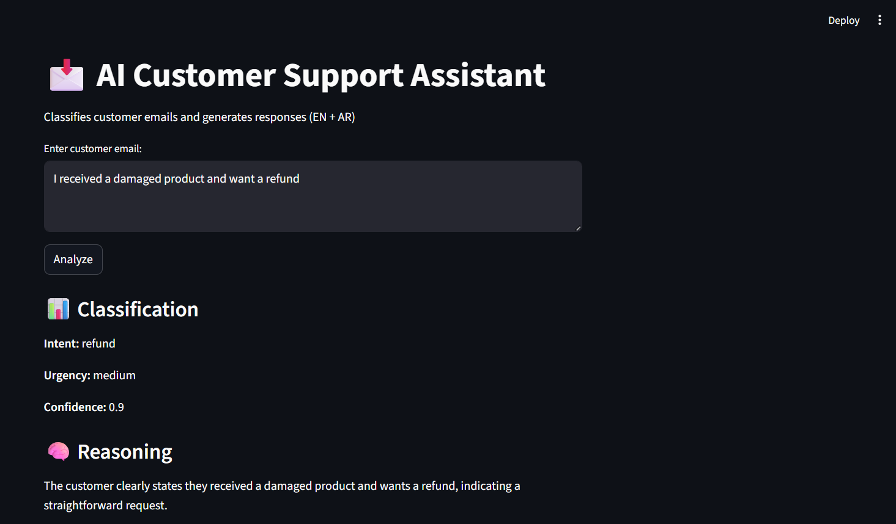

# AI Email Classifier

**Name:** Vaibhav Purwar
**Project:** AI Email Classifier  




## Overview

This project is a simple AI-based system that classifies customer emails and generates appropriate responses.

The goal was to simulate how an e-commerce platform (like Mumzworld) can automatically understand customer intent and reply in both English and Arabic.

---

## Features

* Classifies customer intent:

  * refund
  * exchange
  * store_credit
  * escalate
  * inquiry
  * null (for unclear inputs)

* Detects urgency level (low / medium / high)

* Generates:

  * English reply
  * Arabic reply

* Provides reasoning and confidence score

* Includes an evaluation system with test cases

* Simple UI using Streamlit

---

## Tech Stack

* Python
* OpenAI API (gpt-4o-mini)
* Streamlit (for UI)

---

## Project Structure

* `main.py` → core logic for classification
* `prompts.py` → system prompt definition
* `evaluator.py` → runs test cases and calculates accuracy
* `test_cases.json` → predefined evaluation dataset
* `app.py` → Streamlit UI

---

## How it Works

1. User enters a customer email
2. The input is sent to the OpenAI model
3. The model returns structured JSON containing:

   * intent
   * urgency
   * confidence
   * reasoning
   * responses (EN + AR)
4. Output is displayed in terminal or UI

---

## Evaluation

I created a small test dataset to evaluate model performance.

* Total test cases: 10
* Accuracy: ~80–100% (depending on prompt behavior)

The evaluator compares predicted intent with expected intent.

---

## Observations

* The model performs well on clear inputs (refund, exchange, escalation)
* It sometimes struggles with vague queries
* Using `intent = null` helps handle uncertainty better

---

## Limitations

* Small evaluation dataset
* Depends on API (no offline model)
* Does not handle multi-intent emails
* Arabic quality depends on model output

---

## Why I Designed It This Way

* Used structured JSON output to make results consistent
* Kept logic simple for clarity and debugging
* Added evaluation to measure performance instead of relying on assumptions
* Included multilingual output to match real-world use case

---

## How to Run

### 1. Install dependencies

```bash
pip install openai python-dotenv streamlit
```

### 2. Add API key in `.env`

```
OPENAI_API_KEY=your_key_here
```

### 3. Run main program

```bash
python main.py
```

### 4. Run evaluation

```bash
python evaluator.py
```

### 5. Run UI

```bash
streamlit run app.py
```

---

## Future Improvements

* Larger and more diverse test dataset
* Better handling of mixed intents
* Logging and analytics
* Deploy as web service

---

## Final Note

This project focuses on clarity, structured outputs, and evaluation rather than complex architecture. The aim was to build something understandable, testable, and aligned with real-world use cases.
